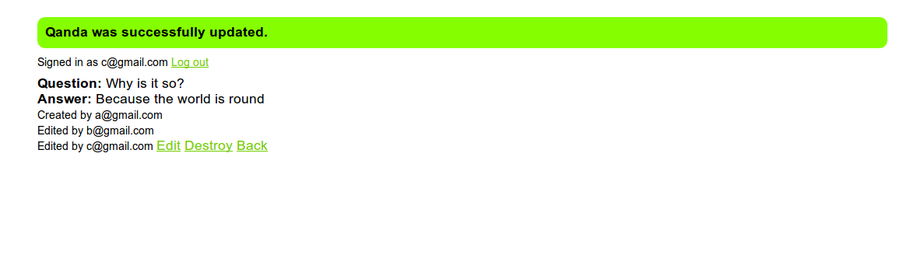

== q_and_a - A Collaborative Question and Answer Site

After you sign up with a valid email address and confirm by clicking on an email link, sign in and start creating Q&A's (or as we like to say, qandas). All Q&As you create will be attributed to you and subsequent editors will be listed.

